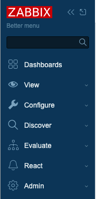
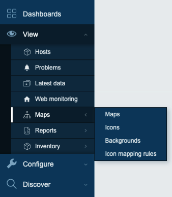
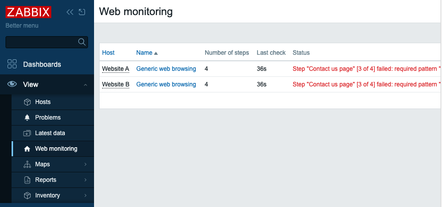
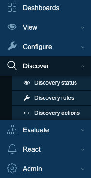
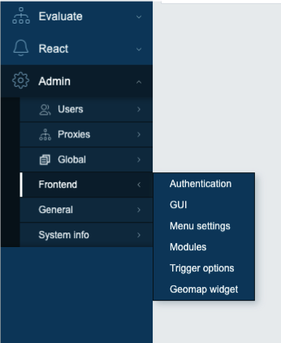

# A better Zabbix menu

A slightly improved version of Zabbix menu, with a task-centric structure.

Project goals:

- Reducing the cognitive effort during menu navigation
- Minimizing the learning curve for new users
- Enhancing the usability (a little bit) without rewriting Zabbix UI 

Design principles:

- Reduce the number of first-level sections
- Group together frequently used items
- Use icons whenever possible
- Respect roles and permissions

Project status:

-  Currently this project is basically a proof-of-concept.

## A task-centric design
Each section tries to represent a high level task:

-  **View** your monitored environment 
- **Configure** objects you mant to monitor 
- **Discover** new hosts on the network
- **Evaluate** services and SLA of your environment
- **React** to events with actions and scripts
- **Admin** your Zabbix instance (users, proxies, frontend) and diagnose Zabbix issues

### Detailed changes
- The Monitoring and Data Collection sections are renamed **View** and **Configure**. - The Inventory and Reports sections are merged into the View section. The Reports menu contains only reports related to monitored objects; reports regarding the status of Zabbix have been moved to the Admin section.
 The new  **Maps** submenu includes the management of icons, backgrounds, and mapping rules (for admin users). 

- **Web monitoring**: a new entry for direct access to all web scenarios.

- A new **Discover** section groups together network discovery rules, discovery status, and discovery actions (frequently used together).

- The Administration section is renamed **Admin** and completely reorganized into submenus: Proxies, Global (macros, regexp, timeouts), Frontend, General, and System info. Also the Users section is merged into Admin.

- The Services section is renamed **Evaluate** and also hosts service actions, for easier access. The Alerts section is renamed **React**.
 
- Any menu entry created by third-party modules that don't fit under the above structure is placed under the **Extra** section.

## How to use it

### Requirements
- Zabbix 7.0.x
- PHP 8.0+

### Installation

On your Zabbix server:

1. Change to directory `/usr/share/zabbix/modules` 
1. Execute: `git clone <url_of_this_repo>` (or simply copy the repo content into a new directory named `zabbix-better-menu`).
1. Open the menu Administration -> General -> Modules and click *Scan directory*
1. A message will confirm the discovery of a new module
1. Locate the new module and toggle it from Disabled to Enabled

Enjoy the new menu!

### Configuration

To change options, navigate to Admin > Frontend > Menu settings.

### Reverting to default menu

To revert to the default Zabbix menu: disable the module on Administration -> General -> Modules.

### Uninstallation

To uninstall the entire module: remove it from module directory and select *Scan directory*.

### Known issues

- Some user role settings (Access to UI elements) may not match the new menu structure, in particular for Administration section
- Icons: for simplicity we use a selection of builtin Zabbix icons from defines.inc.php; sometimes the same icon is reused for different menu entries.  New fancy icons will be designed in future versions. Maybe.
- Zabbix pages in former Administration>General menu keep showing a header with a drop-down menu which matches the old menu structure
- When clicking Backgrounds entry, the Icons entry will be showed as the selected entry in the menu

## Support
Please open a issue if you have any questions or find a bug.

